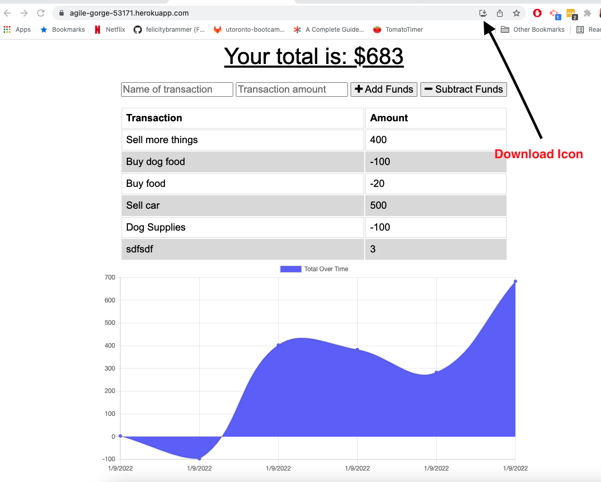

# MyFinance! Budget Tracker

A progressive web application that allows for offline access and functionality
## Description

A budget tracking application that allows users to add expenses and deposits to their budget with or without a connection. If the user enters transactions offline, the total will be updated when they're brought back online. 

## Getting Started
### Dependencies

* mongoose
* express

### Installing 

The application can be loaded by visiting https://agile-gorge-53171.herokuapp.com/

Clicking on the download icon on the url search bar will install the app locally.

